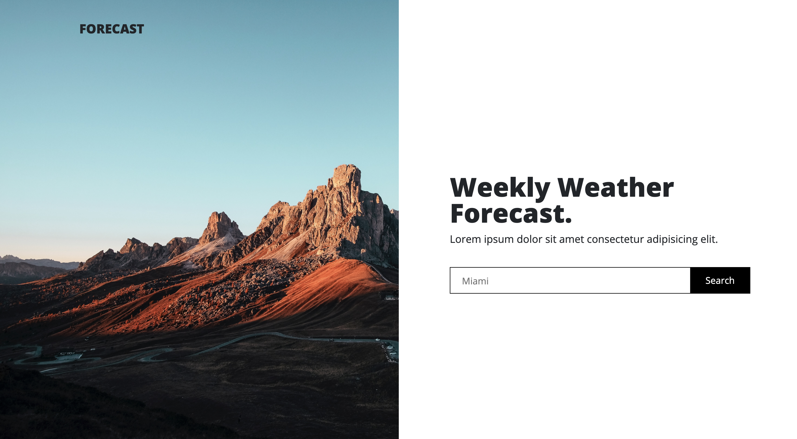

# Forecast

Author: Ernesto Rodriguez

## Summary

This is a weather dashboard that lets users generate a five day forecast for any city the user types in. The forecast is generated using the OpenWeatherMap API.

## User Interface

## Deployed App

You can find the deployed application [here](https://erodrigueztoimil.github.io/weather_app/).
